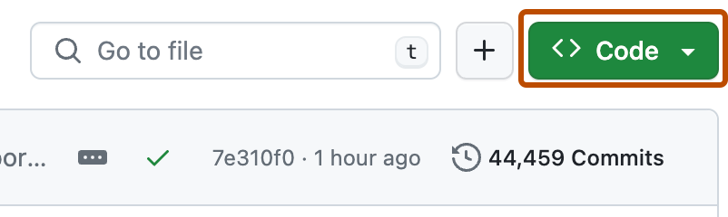
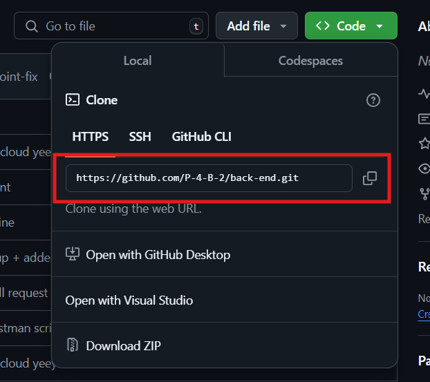

# ReadMe

## Requirements

Visual Studio 2022 (https://visualstudio.microsoft.com/vs/)

NuGet packages:

    - AutoMapper (13.0.1)
    - FirebaseAdmin (3.1.0)
    - Microsoft.AspNetCore.Authentication.JwtBearer (8.0.12)
    - Microsoft.EntityFrameworkCore (8.0.11)
    - Microsoft.EntityFrameworkCore.Design (8.0.11)
    - Microsoft.EntityFrameworkCore.SqlServer (8.0.11)
    - Microsoft.EntityFrameworkCore.Tools (8.0.11)
    - Microsoft.VisualStudio.Web.CodeGeneration.Design (8.0.7)
    - Swashbuckle.AspNetCore (6.4.0)

## Installation

Cloning a repository
On GitHub, navigate to the main page of the repository.
Above the list of files, click Code.

Copy the URL for the repository.
To clone the repository using HTTPS, under "HTTPS", click .
To clone the repository using an SSH key, including a certificate issued by your organization's SSH certificate authority, click SSH, then click .
To clone a repository using GitHub CLI, click GitHub CLI, then click .

Open Git Bash.
Change the current working directory to the location where you want the cloned directory.
Type git clone, and then paste the URL you copied earlier.
git clone https://github.com/P-4-B-2/back-end.git
Press Enter to create your local clone.
$ git clone https://github.com/P-4-B-2/back-end.git> Cloning into `back-end`...> remote: Counting objects: 10, done.> remote: Compressing objects: 100% (8/8), done.> remove: Total 10 (delta 1), reused 10 (delta 1)> Unpacking objects: 100% (10/10), done.

## Guide

Link: [docs.github.com](https://docs.github.com/en/repositories/creating-and-managing-repositories/cloning-a-repository#cloning-a-repository)

